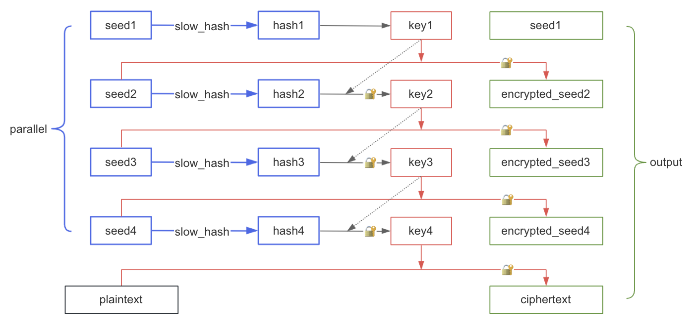
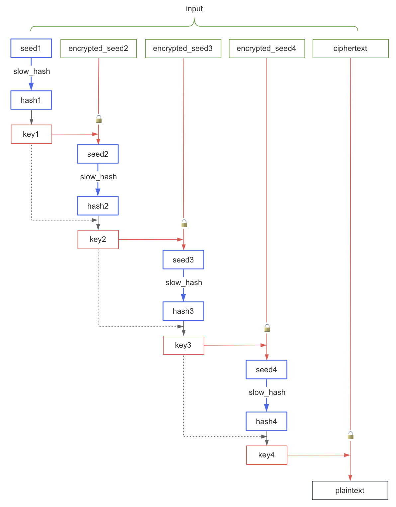
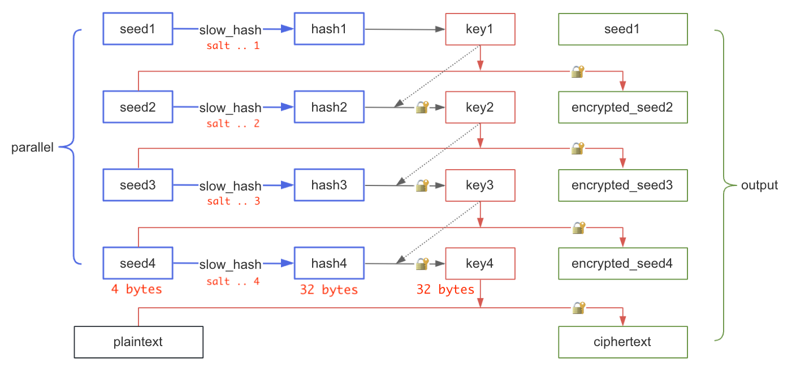

# 在线时间锁

发送者对消息加密后，任何人都无法立即解密，必须经过预定的时间才能解开，从而将消息发送到未来。

数据和算法都是公开的，不依赖任何服务。

## 演示

### 加密

https://etherdream.github.io/timelock/encrypt.html

`Cost` 为解密成本，即解密过程需执行多少次 SHA256 函数。单位为 `MHash` (1 MHash = 1,000,000 Hash)。
右侧可选择解密设备的 CPU 型号，用于评估解密时间。

`CPUs`, `GPUs` 为 CPU 和 GPU 的线程数，用于提高加密速度。

加密前可先点击 `Benchmark` 进行硬件性能评估。笔记本电脑最好连接电源，否则性能将会受限。

### 解密

https://etherdream.github.io/timelock/decrypt.html

解密只能使用 CPU 单线程。

> 建议使用 Safari 加密 (WebCrypto 支持多线程)，Chrome 解密 (WebCrypto 优化得最好)。

## 测试

[测试数据](https://etherdream.github.io/timelock/decrypt.html#version=1.0.0&cost=600&cipher=vcATGmAwxIbxqe9ZRPIknvHTb-lyb2AreBgfmxmvCKK-pkmL-HuZ0VPFHQ&node.name=CPU+%28WebCrypto%29&node.iter=37500000&node.seedNum=8&node.seedLen=4&node.seeds=DcJkt5I2gUZqG1gQb_055GXA06sYQJ0L7ur0PESLiEo&node.salt=lFQ06ZnbXEIkl2X2&check=3t7MgQ)

点击 `Decrypt` 按钮，大约 30 秒完成解密。

你可以将 CPU 型号和解密速度反馈到[这里](https://github.com/EtherDream/timelock/issues/2)，从而为更多型号的 CPU 评估解密时间。（目前只收集了部分 CPU 性能数据）

## 原理

### 加密



```lua
-- 该循环可并行计算 --
for i = 1 to P
  seed[i] = random_bytes()
  hash[i] = slow_hash(seed[i])
end

key = hash[1]

for i = 2 to P
  encrypted_seed[i] = encrypt(seed[i], key)
  key = encrypt(hash[i], key)
end

ciphertext = encrypt(plaintext, key)
```

`P` 为线程数（图中为 4）。每个线程并行计算种子的慢 hash 结果，所有线程完成后，对所有种子（除第一个外）进行加密，每个密钥都取决于其之前的 hash 值，最后使用最终密钥对消息进行加密。

分享 `ciphertext`、`seed1` 和 `encrypted_seed[]`。

### 解密



```lua
key = slow_hash(seed[1])

for i = 2 to P
  seed = decrypt(encrypted_seed[i], key)
  hash = slow_hash(seed)
  key = decrypt(hash, key)
end

plaintext = decrypt(ciphertext, key)
```

由于每个密钥都取决于前一个密钥的结果，因此解密过程无法并行加速，只能单线程串行。

## 为什么使用慢 hash

其实时间锁使用慢 hash 并不好，因为加密和解密需要相同的计算量，尽管加密可通过并行加速。

一个好的时间锁算法，加密的计算量应该远小于解密。例如 RSA 的作者几十年前就在 [这篇论文](https://people.csail.mit.edu/rivest/pubs/RSW96.pdf) 中讲解了如何实现时间锁。当然这些算法也可以移植到浏览器中，但运行效率显然不如本地程序，因为 JavaScript/WebAssembly 虚拟机会损失很多性能。**没有耐心的接收者无需在浏览器中解密，使用本地程序可以更早完成。**

然而浏览器原生支持慢 hash 算法（`PBKDF2`）并对其进行了优化，使用该 API 可弥补浏览器与原生程序的性能差距。虽然加密过程仍不理想，但解密过程至少不会贬值。

<details>
<summary>PBKDF2 是什么?</summary>

PBKDF2 是一个可以指定运行成本的 hash 函数封装算法，类似如下逻辑：

```lua
function pbkdf2(fn, password, salt, iter)
  hash = fn(password, salt)

  for i = 2 to iter
    hash = fn(hash, ...)
  end
  return hash
end
```

`pbkdf2_sha256` 就是将 `hmac_sha256` 作为 hash 函数。
</details>

## 关于慢 hash

由于 WebCrypto API 不支持获取进度、暂停和继续，并且 PBKDF2 算法本身也有迭代次数上限 (2<sup>32</sup>)。为了避免这些问题，我们将单个大迭代拆分为多次小调用：

```lua
function slow_hash(seed, iter)
  let loop = iter / small_iter
  let hash = seed

  for i = 1 to loop
    hash = pbkdf2_sha256(hash, salt, small_iter)
  end
  return hash
end
```

## 关于安全性

不同于常见的 hash 算法，这里的 `slow_hash` 由于运行成本巨大，暴力破解非常困难。因此我们可使用更短的种子，从而减少最终结果的大小。

演示程序默认使用 4 字节的种子。由于每个种子只有 4 字节，因此 hash 值只有 2<sup>32</sup> 种可能。为了缓解彩虹表攻击，我们将线程 id 添加到盐中，这样每个 `slow_hash` 使用不同的盐：

```lua
function slow_hash(seed, iter)
  let loop = iter / small_iter
  let hash = seed

  for i = 1 to loop
    hash = pbkdf2_sha256(hash, salt .. thread_id, small_iter)
  end
  return hash
end
```

如果盐不带线程 id，攻击者可以创建一个 `<seed, hash>` 表，之后所有 `slow_hash` 可直接查表。

盐带上线程 id 后攻击者必须创建一个 `<seed, id, hash>` 表，成本需要 `P` 倍（`P` 为线程数）。

据估算，攻击者如果想提高一倍解密速度，大约需要数百万块顶级 GPU。



直接暴力破解最后一个密钥（例如 key4）是不可行的。虽然 seed4 很短导致 hash4 只有 2<sup>32</sup> 种可能，但 key4 不仅来自 hash4 还依赖 key3，而 key3 又依赖 key2，key2 依赖 key1，它们是串在一起的。由于每个 key 都是 32 字节，既无法猜测也无法暴力破解，必须计算相应种子的 `slow_hash` 才能得出。

> 如果想使用其他长度的种子，可以在控制台中修改 `SEED_LEN` 变量。

## 已知问题

* 移动端设备加密时 GPU 可能会崩溃。

* Firefox: WebCrypto PBKDF2 没有优化，并且最多只能 2 个线程。

* Chrome: WebCrypto PBKDF2 只能 1 个线程。

`Benchmark` 时会检测能使用的线程数。

## 应用场景

* CPU/GPU 性能评估。

* 拼 CPU 性能的红包，最先解密的可以看到红包口令。相比拼运气、拼手速，拼硬件更有趣。

* 临时锁定一个账户，例如将数字货币的钱包私钥进行加密，并丢弃明文，从客观上迫使你拿住一段时间，而不是依靠主观耐力。

## TODO

* 尝试使用 WebGPU API

* 增加进度保存和恢复功能

* 加密可重复校验，防止加密过程中硬件计算错误导致消息永远无法解开
