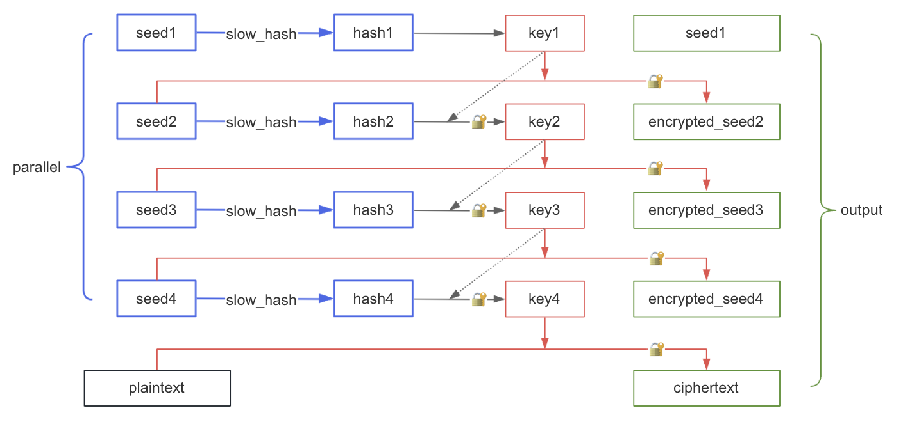
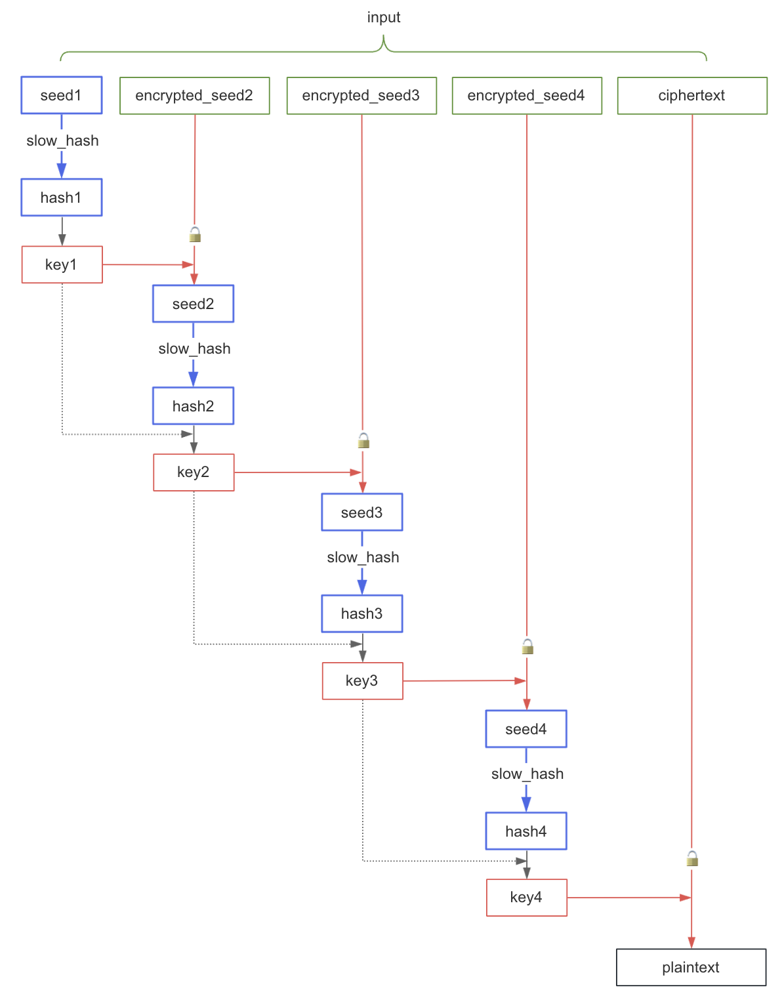
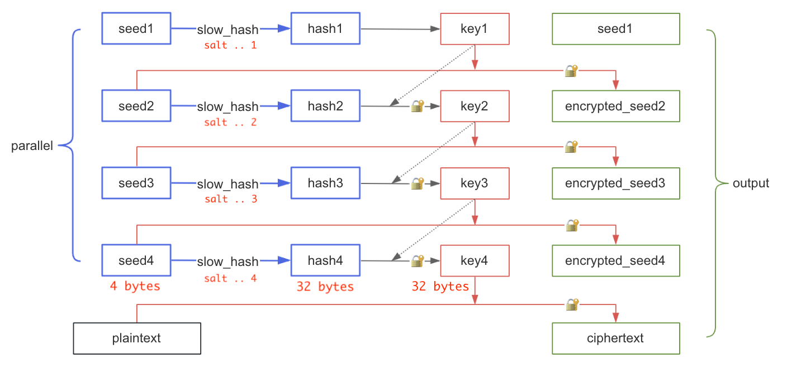

# Timelock

A sender encrypts a message so that no one can decrypt it immediately; it can only be decrypted after a predetermined amount of time. Send information into the future.

All data and algorithms are public; no servers are required.

## Demo

### 🔐 Encryption

https://etherdream.github.io/timelock/encrypt.html

`Cost` is the decryption cost, i.e. the approximate number of SHA-256 computations required during decryption. The unit is MHash. (1 MHash = 1,000,000 hashes)

`GPUs` is the number of GPU threads used during encryption. More threads can distribute the work and reduce encryption time, but more seeds need to be stored. (1 thread = 1 seed)

> Your browser must support WebGPU; otherwise encryption will not work.

### 🔓 Decryption

https://etherdream.github.io/timelock/decrypt.html

Decryption is inherently single-threaded and runs on the CPU.

[Decryption Test](https://etherdream.github.io/timelock/decrypt.html#version=2&cost=1000&salt=BleKXJAoxHh4IuEcGKajyA%3D%3D&cipher=Ldl2d5p3gxBNIUhtU9BFIp-4C_ShZUJRQ7jkRNavsbxy54Ac6Som5En3&seedLen=4&seedNum=64&seeds=8miYnIiIkE7xLWHDuoWIyC-6_6Wq35gs_CocC5XnIljbULyTua8kdJDjIT6CVsZTO2XwzMeZ0X27W_Nf_shqt-2oBbMUJw7PUkYiwwpSA4m7dI2Vu92qC2xDT1uzFfMsHQmyEdw-6Wbxis7T3_3g-N4eKc7OVz62jdWwgxhzEE0MbJwjFEmfbwg7a7wH1850BcC3-irK7zEf_0Z5R7A008xfA4s0xqYQmASW-O43Evh-_-Mbfy4YSbk-8TwdDn0YsfGrLEmqcMNAC-U1jcXMZ_e2cuJ41si1EZXqDcegtW2qFP8sLQq8imaY2bvU_iRb3GA8AkdPigNqzCD3QYPqgg%3D%3D&checksum=2799229604)

Click `Decrypt` to decrypt the message in ~1 minute.

## How it works

### 🔐 Encryption



```lua
seed[] = random_bytes()

-- parallel (GPU) --
for i = 1 to P
  hash[i] = slow_hash(seed[i])
end

key = hash[1]

for i = 2 to P
  encrypted_seed[i] = encrypt(seed[i], key)
  key = encrypt(hash[i], key)
end

ciphertext = encrypt(plaintext, key)
```

Share `ciphertext`, `seed[1]`, and `encrypted_seed[]`.


### 🔓 Decryption



```lua
key = slow_hash(seed[1])

for i = 2 to P
  seed = decrypt(encrypted_seed[i], key)
  hash = slow_hash(seed)
  key = decrypt(hash, key)
end

plaintext = decrypt(ciphertext, key)
```

Because each step depends on the previous output, decryption cannot be parallelized and must run sequentially.

## Why use slow hash

For time-lock puzzles, using a slow hash is not ideal because encryption requires roughly the same amount of work as decryption — although encryption can be sped up via parallelism.

A good time-lock scheme should make encryption much cheaper than decryption. For example, Rivest, Shamir, and Wagner described an RSA-based time-lock decades ago in [this paper](https://people.csail.mit.edu/rivest/pubs/RSW96.pdf). Such schemes can be implemented in the browser, but they typically run less efficiently than native code due to VM overhead. An impatient receiver doesn’t have to decrypt in the browser — using a native program can finish earlier.

Browsers, however, natively support slow hash algorithms via WebCrypto PBKDF2. Using this API helps narrow the performance gap between browser and native environments. This makes encryption heavier for the sender, but it doesn’t affect the receiver.

<details>
<summary>What’s PBKDF2?</summary>
PBKDF2 is a wrapper around a PRF (here HMAC-SHA256) that repeats it for a configurable number of iterations, roughly:

```lua
function pbkdf2(password, salt, iter)
  hash = hmac_sha256(password, salt)

  for i = 2 to iter
    hash = hmac_sha256(hash, ...)
  end
  return hash
end
```
</details>

## About slow hash

WebCrypto PBKDF2 does not provide progress reporting, and the iteration count is bounded (up to 2<sup>32</sup>). To work around this, we split a large target iteration count into multiple smaller PBKDF2 calls:

```lua
function slow_hash(seed, iter)
  loop = iter / small_iter
  hash = seed

  for i = 1 to loop
    hash = pbkdf2_sha256(hash, salt, small_iter)
  end
  return hash
end
```

In this project, small_iter is up to `20,000,000`, which takes about 1 second on a recent desktop CPU.

<details>
<summary>Test</summary>

```js
const opt = {
  name: 'PBKDF2',
  hash: 'SHA-256',
  salt: crypto.getRandomValues(new Uint8Array(16)),
  iterations: 2e7
}
const key = await crypto.subtle.importKey(
  'raw', Uint8Array.of(0), 'PBKDF2', false, ['deriveBits']
)
console.time('time')
await crypto.subtle.deriveBits(opt, key, 256)
console.timeEnd('time')
```
</details>

## About security

Because `slow_hash` is intentionally expensive, using parallelism to brute-force the seed space as a shortcut around the sequential decryption work is impractical. This allows us to use shorter seeds to reduce the output size; in this project, each seed is 4 bytes by default, and all seeds share a single 16-byte random salt.

To further harden the design, we incorporate the seed index `p` and the loop index `i` into the salt used by PBKDF2, making precomputation significantly harder.

```lua
function slow_hash(seed, iter, p)
  loop = iter / small_iter
  hash = seed

  for i = 1 to loop
    hash = pbkdf2_sha256(hash, salt || p || i, small_iter)
  end
  return hash
end
```

Without `p` and `i` in the salt, an attacker could compute `slow_hash` for the entire seed space in parallel for a fixed salt, which could turn the sequential decryption work into a large offline precomputation.

With `p` and `i` mixed into the salt, this must be repeated for every distinct `(p, i)`, increasing the attacker’s work by a factor of `P * loop`.



Because the final key is derived through a dependency chain (key4 depends on key3, which depends on key2, etc.), even though each seed is only 4 bytes, an attacker still cannot brute-force starting from the last seed alone; all seeds must be involved in the computation.

> To use longer seeds, modify `SEED_LEN` in the browser console.


## When to use

* CPU/GPU performance benchmarks.

* Posting a CPU race on social media: the first person to unlock it gets a coupon link. Competing on hardware is more interesting than competing on luck.

* Temporarily locking an account (e.g., storing a wallet key in a time capsule).
