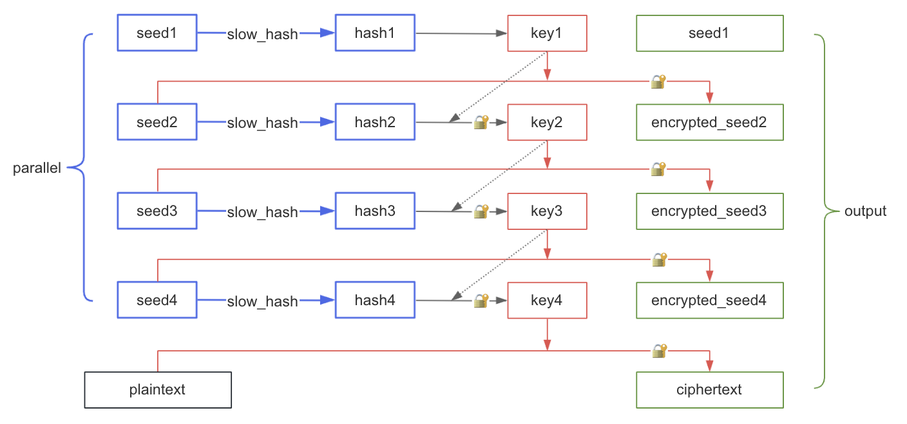

# Timelock Online

[中文文档](README-zh.md)

A sender encrypts the message and the no one cannot decrypt it immediately, but must wait for a specified time before seeing the message. Send information into the future.

Data and algorithms are public, no servers are required.

## Demo

### Encryption

https://etherdream.github.io/timelock/encrypt.html

`Cost` is the decryption cost, i.e. how many times the receiver needs to repeat SHA256 hash function to complete the decryption. The unit is MHash. (1 MHash = 1,000,000 Hash)

You can select the CPU model of the decryption device on the right side for evaluating the decryption time.

`CPUs`, `GPUs` are the number of CPU and GPU threads used to speed up encryption.

Before encryption, you can click the `Benchmark` to evaluate the hardware performance. It is best to keep the laptop on AC power, otherwise its performance will be limited.

### Decryption

https://etherdream.github.io/timelock/decrypt.html

Decryption uses only a single CPU thread.

> It is recommended to use Safari for encryption (WebCrypto supports multi-threading) and Chrome for decryption (WebCrypto is the best optimized).

## Test

[Decryption Test](https://etherdream.github.io/timelock/decrypt.html#version=1.0.0&cost=600&cipher=vcATGmAwxIbxqe9ZRPIknvHTb-lyb2AreBgfmxmvCKK-pkmL-HuZ0VPFHQ&node.name=CPU+%28WebCrypto%29&node.iter=37500000&node.seedNum=8&node.seedLen=4&node.seeds=DcJkt5I2gUZqG1gQb_055GXA06sYQJ0L7ur0PESLiEo&node.salt=lFQ06ZnbXEIkl2X2&check=3t7MgQ)

Click the `Decrypt` button and the message will be decrypted after ~30s.

## How it works

### Encryption



```lua
-- parallel --
for i = 1 to P
  seed[i] = random_bytes()
  hash[i] = slow_hash(seed[i])
end

key = hash[1]

for i = 2 to P
  encrypted_seed[i] = encrypt(seed[i], key)
  key = encrypt(hash[i], key)
end

ciphertext = encrypt(plaintext, key)
```

`P` is the thread number (4 in the illustration). Each thread computes the `slow_hash` of the seed in parallel, after all threads are done, all seeds (except the first one) are encrypted, each key depends on its previous hash value, and the message is encrypted with last key.

Share `ciphertext`, `seed1`, and `encrypted_seed[]`.


### Decryption


```lua
key = slow_hash(seed[1])

for i = 2 to P
  seed = decrypt(encrypted_seed[i], key)
  hash = slow_hash(seed)
  key = decrypt(hash, key)
end

plaintext = decrypt(ciphertext, key)
```

Since each key depends on its previous result, decryption cannot be accelerated in parallel, only serially.

## Why use slow hash

For time-lock puzzles, using slow hash is a bad strategy because encryption takes the same amount of work as decryption, although encryption can be accelerated by parallelization.

A good time-lock algorithm should take much less work to encrypt than to decrypt. For example, authors of the RSA explained how to implement time-lock puzzles in [this paper](https://people.csail.mit.edu/rivest/pubs/RSW96.pdf) decades ago. Of course, these algorithms can be ported to the browser, but obviously it will not run as efficiently as native programs because a lot of performance will be lost in the JavaScript/WebAssembly VM. **For impatient receivers, there is no need to decrypt the message in the browser, it can be done earlier using a native program.**

However browsers natively support slow hash algorithms (`PBKDF2`) and have optimized them, using this API reduces the performance gap between browsers and native programs. Although this is not friendly to the sender, it makes no difference to the receiver.

<details>
<summary>What's PBKDF2?</summary>
PBKDF2 is a hash function wrapper that can specify a cost, similar to the following logic:

```lua
function pbkdf2(fn, password, salt, iter)
  hash = fn(password, salt)

  for i = 2 to iter
    hash = fn(hash, ...)
  end
  return hash
end
```

`pbkdf2_sha256` uses `hmac_sha256` as the hash function.
</details>

## About slow hash

Unfortunately, WebCrypto PBKDF2 does not provide a way to get progress, pause and resume, and the PBKDF2 itself has a limit on iterations (2<sup>32</sup>). To avoid these problems, we split a single large iteration into multiple small calls.

```lua
function slow_hash(seed, iter)
  let loop = iter / small_iter
  let hash = seed

  for i = 1 to loop
    hash = pbkdf2_sha256(hash, salt, small_iter)
  end
  return hash
end
```

## About security

Unlike common hash algorithms, the `slow_hash` algorithm here is very difficult to crack due to its huge cost. Therefore, we can use shorter seeds to reduce the result size.

By default, each seed is 4 bytes. Since the seed is only 4 bytes, its hash has only 2<sup>32</sup> possibilities. To mitigate pre-computation attacks, we add the thread id to the salt so that each `slow_hash` uses a different salt:

```lua
function slow_hash(seed, iter)
  let loop = iter / small_iter
  let hash = seed

  for i = 1 to loop
    hash = pbkdf2_sha256(hash, salt .. thread_id, small_iter)
  end
  return hash
end
```

Without the thread id, an attacker can make a `<seed, hash>` table, and then all threads can look up the table.

With the thread id, the attacker must make a `<seed, id, hash>` table, which is `P` times more expensive (`P` is the number of threads).

By estimation, if an attacker wants to double the decryption speed, it will require millions of top-level GPUs.


It's impossible to brute-force the last key directly, e.g. key4, because key4 not only comes from hash4, but also depends on key3, and key3 also depends on key2, and key2 depends on key1, they are chained together. Since each key is 32 bytes, it can neither be guessed nor brute-forced, it must be involved in its `slow_hash` computation.

> If you want to use a longer seed, you can modify the `SEED_LEN` variable in the browser console.


## Known issues

* GPU may crash when encrypting on mobile devices

* Firefox: WebCrypto PBKDF2 is not optimized, and cannot be run in more than 2 threads. 

* Chrome: WebCrypto PBKDF2 cannot be run in more than 1 thread.

`Benchmark` can detect the number of threads that can be used.


## When to use

* CPU/GPU performance benchmarks.

* Post a CPU race on SNS, the first person to unlock it will get a coupon link. It is more interesting to compete on hardware than on luck.

* Temporarily lock an account, such as hiding the wallet private key in a time capsule. Let Moore's Law take over your account, not your spirit.


## TODO

* Using WebGPU instead of WebGL

* Support saving and restoring progress

()